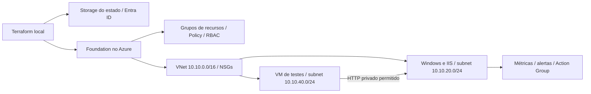

# Azure Enterprise Foundation

Um projeto prático de infraestrutura no Azure com Terraform, Windows Server e IIS.

Construí este laboratório para praticar como organizar uma aplicação interna na nuvem: preparar a rede, controlar acessos, aplicar regras de governança e investigar falhas. Usei a Contoso Brasil como cenário fictício de uma empresa recebendo sua primeira aplicação Windows.

O projeto foi realizado em uma **conta gratuita do Azure (Free Trial), utilizando os créditos disponíveis**, sem migrar para pagamento conforme o uso. Ao terminar os testes, removi a infraestrutura. O código e as evidências ficam aqui para consulta e para quem quiser reproduzir o laboratório na própria assinatura.

## O que o projeto faz

O Terraform cria a base para hospedar uma página interna no IIS e testar os controles ao redor dela:

- **Organização:** grupos de recursos separam rede, aplicação, operação e armazenamento do estado.
- **Rede:** duas subnets separam a aplicação da máquina de testes. Os NSGs permitem o HTTP necessário e bloqueiam acessos laterais usados nos testes.
- **Aplicação:** uma VM Windows Server executa o IIS. Uma segunda VM temporária permite validar o acesso privado entre as subnets.
- **Governança:** Azure Policy restringe regiões, tamanhos de VM e exige tags para identificar os recursos.
- **Permissões:** quatro personas de identidade gerenciada exercitam diferentes responsabilidades com RBAC.
- **Monitoramento:** métricas e alertas ajudam a identificar uso de CPU e indisponibilidade da VM. Incidentes controlados permitem comparar uma falha da aplicação com um bloqueio de rede.
- **Infraestrutura como código:** o estado da foundation fica em um Storage separado, com autenticação pelo Entra ID e acesso de rede restrito.

A ideia é percorrer o ciclo completo: construir, testar o que deve funcionar, testar o que deve ser bloqueado e remover os recursos ao final.

## Arquitetura

A foundation foi implantada em North Central US e o backend em Brazil South. A escolha da região da aplicação foi ajustada conforme a disponibilidade de tamanho de VM na assinatura.



Usei Windows Server 2019 Core, VM `Standard_B2ats_v2`, Trusted Launch e disco Standard SSD de 32 GiB. O acesso administrativo fica desabilitado por padrão e pode ser habilitado de forma restrita para o ensaio. A página do IIS é interna; este projeto não publica um site aberto na internet.

## O que foi testado

| Área | Resultado |
|---|---|
| Terraform | Backend remoto, gravação do estado e lock validados |
| Windows e IIS | Resposta HTTP 200 e verificações do sistema e do acesso administrativo |
| Rede | HTTP privado permitido e tentativas de tráfego lateral bloqueadas |
| RBAC | 12 testes de permissões com personas de identidade gerenciada |
| Policy | Testes de bloqueio por região, tamanho de VM e tags |
| Incidentes | IIS indisponível e recuperado; regra HTTP alterada de Allow para Deny e restaurada |
| Alertas | Disparos reais registrados no Azure; entrega do e-mail ainda não comprovada |
| Limpeza | Infraestrutura removida, com inventário final sem recursos ou grupos de recursos |

A API de envio de notificação de teste retornou uma restrição da assinatura gratuita. Por isso, o disparo do alerta e a entrega do e-mail estão tratados como validações diferentes na documentação.

## Como reproduzir

Você pode usar este repositório como base para montar o mesmo laboratório na sua assinatura. Enquanto o repositório estiver privado, será necessário ter acesso a ele para clonar.

```powershell
git clone https://github.com/brunokdalcastel/azure-enterprise-foundation.git
cd azure-enterprise-foundation
```

O ambiente usado foi Windows com PowerShell, Azure CLI 2.80.0 e Terraform 1.14.3. O provider AzureRM está fixado em 4.74.0 nos arquivos de configuração.

1. Leia a [arquitetura](docs/01-arquitetura.md) e a [preparação do ambiente](docs/03-preparacao-bootstrap.md). Confira sua assinatura, permissões, créditos, região e quota antes de criar recursos.
2. Configure os valores locais a partir dos arquivos `terraform.example.tfvars` em `bootstrap/` e `foundation/`. Use seus próprios identificadores, IPs e um nome de Storage disponível. Senhas e destinatários de alertas ficam fora do Git.
3. Crie o bootstrap e inicialize o backend da foundation. O estado do bootstrap deve permanecer local, pois ele gerencia o próprio Storage do estado remoto.
4. Execute `terraform fmt -check`, `terraform validate` e revise cada `terraform plan` antes de aplicar. Siga as etapas da documentação para habilitar aplicação, testes de RBAC e monitoramento; esses blocos ficam desligados por padrão.
5. Execute os testes, registre seus resultados e remova os recursos temporários ao terminar cada bloco.
6. No encerramento, destrua a foundation antes do bootstrap e confira o inventário, incluindo recursos criados automaticamente fora do Terraform.

O ambiente original já foi removido. Para reproduzir, é necessário criar um novo backend e configurar seus valores locais. Os documentos de cada etapa registram o que existia naquele momento; não indicam uma infraestrutura que continua ativa.

## Documentação

| Documento | Conteúdo |
|---|---|
| [Plano por etapas](PLANO.md) | Caminho da arquitetura ao encerramento |
| [Arquitetura](docs/01-arquitetura.md) | Requisitos, decisões e revisões do desenho |
| [Custos e verificações iniciais](docs/02-custos-e-preflight.md) | Critérios para preparar a implantação |
| [Bootstrap](docs/03-preparacao-bootstrap.md) | Estado, autenticação e preparação |
| [Governança e rede](docs/04-governanca-rede.md) | Grupos, Policy, VNet e NSGs |
| [Preparação do Windows](docs/05-preflight-windows.md) | Disponibilidade, imagem e tamanho da VM |
| [Windows e IIS](docs/06-windows-iis.md) | Implantação e configuração |
| [Evidências do Windows](docs/07-evidencias-windows-iis.md) | Testes e remoção do workload |
| [RBAC e segmentação](docs/08-rbac-segmentacao.md) | Permissões e testes de rede |
| [Operação e incidentes](docs/09-operacao-incidentes.md) | Alertas, diagnóstico e limitações |
| [Case e encerramento](docs/10-encerramento-case.md) | Resultados, decisões e inventário final |

Os diretórios `scripts/` e `tests/` contêm os scripts de verificação e os templates de validação. As evidências sanitizadas em JSON estão em `docs/`.

## Uso da conta gratuita e limites do laboratório

A execução utilizou créditos do Azure Free Trial com o limite de gastos ativo. Isso não significa que todos os recursos sejam gratuitos: VMs, discos, IPs, Storage e monitoramento podem consumir créditos. Confira os preços e as condições da sua assinatura antes de reproduzir. Desalocar uma VM não remove seu disco nem seu IP; a limpeza faz parte do exercício.

O foco é aprendizado prático. O desenho não inclui alta disponibilidade ou compromissos de produção. As personas usadas nos testes são identidades de serviço, não testes de MFA ou login de usuários. O fluxo foi executado localmente com Terraform; GitHub Actions não faz parte desta versão.

Estados, planos, credenciais e configurações pessoais não são publicados no repositório.
