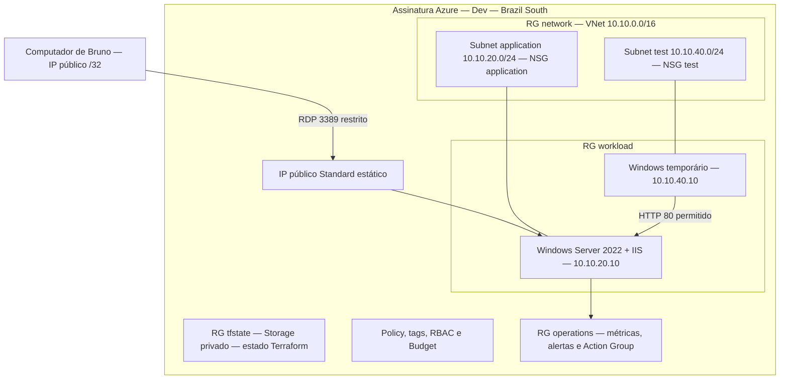

# Arquitetura v1 — Azure Enterprise Foundation

Desenho original de 21/09/2026. Revisão de execução em 24/09: foundation em North Central US, nomes ncu, Windows Server 2019 Core B2ats_v2 e discos de 32 GiB; backend permanece Brazil South. Workloads temporários são destruídos após testes. Tags agora Deny. Na Parte 5, quatro identidades gerenciadas descartáveis representam as personas, em vez de grupos/contas humanas. Resultados e limites em [Parte 5](08-rbac-segmentacao.md). Decisões abaixo que divergirem deste registro são históricas.

## 1. Requisitos e limites

Simular a Contoso Brasil recebendo sua primeira aplicação Windows interna. Demonstrar organização, rede, menor privilégio, governança, monitoramento e troubleshooting. Uma assinatura, ambiente Dev, infraestrutura descartável. Sem SLA de produção, alta disponibilidade, backup ou dados reais. Uma falha pode ser recuperada recriando com Terraform; RPO/RTO de produção não são prometidos.

Usar exclusivamente créditos de uma assinatura Free Trial com spending limit ativo. Não fazer upgrade, remover esse limite, adquirir reservas ou ofertas pagas de terceiros. Budget não bloqueia gastos. Verificar a modalidade real antes de criar até mesmo o backend. Excluir tudo após os testes.

## 2. Desenho

O desenho mostra associações lógicas; recursos dentro de uma subnet podem estar em outro RG. VNet/subnets/NSGs ficam no RG network; VMs, NICs, discos e seus IPs públicos no RG workload. Identidades/grupos ficam no Entra ID, fora dos RGs.

## 3. Decisões e justificativas

| Tema | Decisão |
|---|---|
| Região | Brazil South (`brazilsouth`, abreviação `brs`): coerência com o cenário brasileiro e proximidade; não declarada a região mais barata |
| Compute | `Standard_B2s_v2`, 2 vCPUs e 8 GiB, sob demanda; horas a definir após cotação; desalocar entre sessões e excluir em pausas longas e ao concluir |
| Imagem | Windows Server 2022 Datacenter Azure Edition Gen2, imagem oficial Microsoft sem SQL ou software pago adicional; verificar URN e fixar versão disponível na implementação |
| Disco | SO Standard SSD LRS, 128 GiB por VM, sem disco de dados; validar tamanho mínimo da imagem |
| Aplicação | IIS com página estática interna; configuração idempotente via extensão de VM e PowerShell versionado |
| Proteção da VM | Trusted Launch, Secure Boot e vTPM se suportados pela combinação exata de imagem/SKU; conferir na Parte 2 |
| Rede | Uma VNet, duas subnets privadas (`default_outbound_access_enabled = false`), DNS fornecido pelo Azure; sem UDR/peering |
| Entrada | IP público Standard estático por VM enquanto existir; RDP somente do IPv4 público de Bruno em /32 e somente durante sessão administrativa |
| Saída | IP público associado à NIC como método explícito; sem NAT Gateway. Permissões de saída detalhadas abaixo |
| Bastion | Não implantado na v1. Developer é gratuito onde disponível, mas não fornece egress. Aqui o IP público já resolve egress e RDP restrito com menos componentes. Em produção, revisar administração privada e saída centralizada |
| Operação | Métricas nativas, Activity Log, dois alertas de métricas e um Action Group com e-mail; sem agente/Log Analytics/VM Insights na v1 |
| IaC | Terraform local; dois root modules (`bootstrap/` e `foundation/`), sem abstrações por módulo para cada recurso |
| GitHub Actions | Fora da v1; evolução após implantação reproduzível e testes |

Se região ou SKU não estiverem disponíveis, não fazer substituição silenciosa: registrar o impedimento, comparar SKU x64 com 2 vCPUs e 4–8 GiB ou região alternativa, atualizar preço/ADR/Policy antes do apply. Não é motivo para atualizar a assinatura para paga.

## 4. Naming e tags

Padrão: `<tipo>-<funcao>-dev-brs-<sequencia>`. Exemplos: `rg-network-dev-brs-01`, `vnet-foundation-dev-brs-01`, `nsg-application-dev-brs-01`, `vm-web-dev-brs-01`, `pip-web-dev-brs-01`. Backend usa `lab` no lugar de `dev`: `rg-tfstate-lab-brs-01`. Nomes do Windows: `winweb01` e `wintest01`, respeitando o limite do hostname. Storage Account: `sttfstatebrs<suffix>` em minúsculas alfanuméricas, tamanho válido e unicidade global. Subnets: `snet-application`, `snet-test`.

Tags nos RGs e recursos que as suportam: `Environment=Dev` (backend `Lab`), `Owner=CloudTeam`, `Project=AzureFoundation`, `CostCenter=IT-Lab`, `ManagedBy=Terraform`. Não usar nome pessoal ou e-mail como Owner. Subnets/associações que não suportam tags não serão artificialmente exigidas pela Policy. Valores obrigatórios definidos em locals, sem duplicação manual.

## 5. Matriz de tráfego

NSGs associados às subnets, sem NSG na NIC como padrão. Um NSG adicional na NIC pode ser usado temporariamente apenas no exercício e depois removido pelo código. NSGs são stateful; não criar regra inversa apenas para respostas.

| Direção | Origem → destino | Porta | Prioridade/ação |
|---|---|---|---|
| Entrada, ambas as subnets | IP público administrativo /32 → VM correspondente | TCP 3389 | 100 Allow, habilitada apenas durante administração |
| Entrada application | 10.10.40.10 → 10.10.20.10 | TCP 80 | 110 Allow |
| Entrada, ambas | VirtualNetwork → Any | Any | 4000 Deny, após permissões específicas; substitui a abertura lateral padrão |
| Entrada restante | Any → Any | Any | Deny padrão; HTTP não exposto à Internet |
| Saída, ambas | VM → Azure DNS 168.63.129.16 | UDP/TCP 53 | 100 Allow |
| Saída, ambas | VM → Internet | TCP 80,443 | 110 Allow para atualização, agente e endpoints; não é filtragem por domínio |
| Saída, ambas | VM → Internet | UDP 123 | 120 Allow para sincronismo de horário quando necessário |
| Saída test | 10.10.40.10 → 10.10.20.10 | TCP 80 | 130 Allow |
| Saída restante | Any → Any | Any | 4096 Deny |

Conferir tráfego da plataforma/VM Agent antes de validar a regra final; endpoints especiais da plataforma têm comportamento próprio. Windows Firewall permite RDP conforme origem administrativa e HTTP somente da VM auxiliar. A inicialização via extensão depende de conectividade do agente e não pode ser bloqueada acidentalmente. Nenhuma regra RDP com origem Any. `admin_ipv4_cidr` validado como IPv4 /32, variável sem default permissivo. Se IP do usuário mudar, atualizar Terraform antes de conectar.

HTTP sem TLS é aceito apenas para página interna sem credenciais/dados. Não representa o padrão de publicação de uma aplicação de produção.

## 6. Identidade e RBAC

| Persona | Role e escopo | Resultado esperado |
|---|---|---|
| Executor Terraform | Conta de Bruno com permissões existentes verificadas para recursos, Policy e assignments; bootstrap tratado como acesso privilegiado | Construir e remover o lab, sem adicionar Owner a todas as personas |
| Operador de rede | Network Contributor no RG network | Alterar VNet/NSG, sem acesso geral à workload |
| Analista da workload | Virtual Machine Contributor no RG workload e Reader no RG network | Gerenciar VMs; não escrever na VNet/NSG |
| Desenvolvedor | Role customizada `Lab VM Power Operator` na VM principal + Reader no RG workload | Ler e executar start/restart/deallocate, sem extensões, Run Command, discos, NICs ou rede |
| Auditor | Reader nos RGs de foundation | Consultar recursos, sem modificar; acesso de custos separado se necessário |
| Backend | Storage Blob Data Contributor para executor no container tfstate | Ler/escrever/lock do estado por Entra ID |

Escopo de atribuição não concede permissão fora dele. A role do analista não inclui por si só a permissão necessária para criar NICs/conectar novas VMs à subnet; criação inicial é função do executor. O desenvolvedor é operador do ciclo de energia, não administrador do Windows. A role customizada concede `Microsoft.Compute/virtualMachines/read`, `/start/action`, `/restart/action` e `/deallocate/action`; nenhum wildcard de escrita. Verificar permissões herdadas antes dos testes negativos.

Criar grupos de segurança para personas e uma identidade de teste sem privilégios herdados, com membership alterada entre cenários. Se Bruno não tiver permissão Entra para criar identidade/grupo, usar identidade de teste existente autorizada; não declarar teste RBAC concluído sem execução real. Criação Entra via provider azuread, com permissões verificadas separadamente das permissões Azure RBAC.

Login Windows: administrador local apenas para Bruno, senha forte injetada fora do Git. Terraform pode armazená-la em state mesmo com `sensitive=true`; restringir e proteger o estado. Não conceder login Windows ao desenvolvedor da v1. MFA para acesso Azure conforme suporte/configuração do tenant; não pressupor licenças PIM/Conditional Access.

## 7. Governança

Aplicar políticas somente nos três RGs da foundation, deixando bootstrap separado para evitar auto-bloqueio do backend. Deny para região diferente de Brazil South com tratamento correto de recursos globais; localização dos próprios RGs controlada pelo Terraform. Allow-list de SKUs das VMs com o SKU escolhido. Tags: começar com Audit de presença/valores para tipos que suportam tags e, após teste, passar a Deny. Não prometer herança automática: Terraform aplica tags diretamente. Exercício de remediação será correção pelo Terraform; Modify não é necessário na v1.

Policies não corrigem naming retroativamente: naming é regra de código e revisão. Deploy fora da região deve retornar bloqueio associado à assignment. Teste sem tag deve demonstrar Audit e depois Deny sem criar recurso cobrado desnecessário. Guardar plano e alterações esperadas de modo local; não deixar drift do exercício pendente.

## 8. Monitoramento e testes

- CPU: Percentage CPU, Average > 80%, janela de 5 minutos, avaliação de 1 minuto. Teste com carga limitada e observação de CPU credits da série B; se necessário, reduzir limiar temporariamente, registrar e restaurar.
- Disponibilidade: `VmAvailabilityMetric`, agregação Minimum < 1 em 5 minutos; conferir suporte da métrica e comportamento durante parada/desalocação. Ausência de dados não equivale automaticamente a zero. Validar com interrupção controlada e registrar se o sinal escolhido detectou o evento.
- Activity Log: investigar alteração de NSG e uma operação de VM, documentando horário, operação, ator e status. Sem exportação paga na v1.
- E-mail do Action Group é dado local e não vai ao Git. Diferenciar teste de entrega de teste real da condição do alerta.
- Disponibilidade da VM não é saúde do IIS. Validar IIS com HTTP da VM auxiliar; parar W3SVC para mostrar que VM disponível pode servir aplicação indisponível. Monitoramento contínuo de aplicação fica fora desta v1.
- Manutenção planejada: desabilitar os alertas de VM no código durante períodos de desligamento, registrar e reabilitar nos testes. Não deixar alertas desligados sem anotação.

## 9. Terraform e estado

`bootstrap/` cria Storage Account StorageV2 Standard LRS, container privado e assignment de dados. HTTPS/TLS 1.2+, acesso anônimo desabilitado, shared key desabilitada onde suportado pelo fluxo, acesso de rede restrito ao IP administrativo atual; soft delete e versionamento curtos (7 dias). Sem Private Endpoint por custo/complexidade nesta v1. Estado inicial local protegido e fora do Git; manter até remover bootstrap. Não migrar esse estado para o próprio backend que ele precisa destruir.

`foundation/` usa backend azurerm com Azure CLI + Entra ID, um blob por ambiente e locking nativo. Arquivos por responsabilidade: providers, versions, variables, locals, network, compute, rbac, policy, monitoring, budget e outputs. Fixar versões testadas dos providers na Parte 2 e versionar `.terraform.lock.hcl`. Evitar workspaces e módulos reutilizáveis prematuros.

Fluxo: fmt → validate → plan → revisar → apply → testar → registrar. Terraform gerencia configuração; CLI pode ser usada para consulta, diagnóstico e operações de energia, com reconciliação quando houver drift. Nenhum segredo nos outputs. Variáveis sensíveis não serão passadas em linhas de comando que exponham o valor no histórico.

## 10. Critérios de aceitação

1. Plano após apply sem mudanças inesperadas; bootstrap e backend operantes.
2. RDP funciona apenas do IP autorizado; página IIS acessível da VM de teste e não publicamente.
3. Comunicação lateral não autorizada bloqueada; diagnosticar NSG e Windows Firewall separadamente.
4. Desenvolvedor reinicia VM e falha ao modificar VNet; auditor não consegue escrever.
5. Deploy fora da região e recurso sem tag obrigatória bloqueados após ativar Deny.
6. Alerta de CPU entregue, sinal de disponibilidade validado e alteração localizada no Activity Log.
7. Custos revisados, evidências sanitizadas e recursos removidos ao final.

## 11. Remoção

Remover primeiro a VM auxiliar após testes. Ao encerrar o projeto, guardar evidências não sensíveis; destruir foundation enquanto backend ainda está acessível; confirmar estado sem recursos e inventário Azure. Verificar assignments/roles customizadas/identidades de teste e Network Watcher eventualmente criado fora dos RGs. Remover somente itens do laboratório. Remover bootstrap pelo seu estado local por último, incluindo versões de blobs conforme necessário. Conferir discos, IPs, snapshots, alertas e Storage remanescentes. Não remover a conta de Bruno, a assinatura ou identidades preexistentes.

## Referências verificadas

- [Bsv2: especificações](https://learn.microsoft.com/en-us/azure/virtual-machines/sizes/general-purpose/bsv2-series)
- [Saída explícita](https://learn.microsoft.com/en-us/azure/virtual-network/ip-services/default-outbound-access)
- [Regras padrão de NSG](https://learn.microsoft.com/en-us/azure/virtual-network/network-security-groups-overview)
- [Roles de compute](https://learn.microsoft.com/en-us/azure/role-based-access-control/built-in-roles/compute)
- [Limite de gastos](https://learn.microsoft.com/en-us/azure/cost-management-billing/manage/spending-limit)
- [Backend Terraform](https://developer.hashicorp.com/terraform/language/backend/azurerm)
- [Monitoramento de disponibilidade](https://learn.microsoft.com/en-us/azure/virtual-machines/flash-azure-monitor)

Custos e verificações de execução: ver `02-custos-e-preflight.md`.

## Uso dos créditos
Créditos gratuitos: usar somente o necessário ao escopo, dentro do saldo e validade verificados; a meta é não gerar cobrança externa aos créditos. A execução mantém o Free Trial e o limite de gastos ativo. Cotar os recursos antes de implantar, acompanhar saldo e remover tudo ao concluir. Desalocar entre sessões e excluir em pausas longas; discos/IPs persistentes também consomem créditos. Não ampliar escopo apenas porque há crédito disponível.
